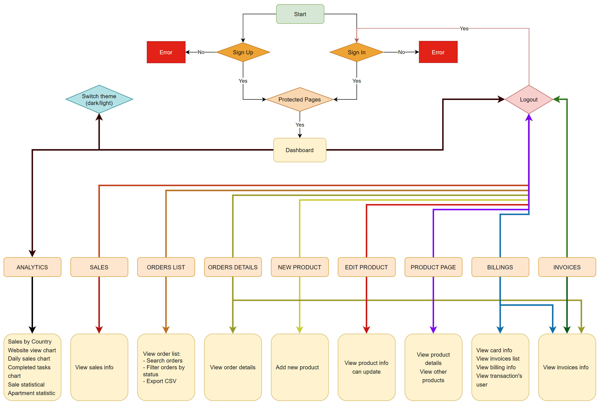

# **REACT PROJECT - TREMOR DASHBOARD**

## Overview

- This is an internal project which will demonstrate the dashboard like a real system.
- [Design](https://demos.creative-tim.com/nextjs-material-dashboard-pro/dashboards/analytics)
- You can find more details on [Requirements and plan](https://docs.google.com/document/d/1AOGXX2PbQ1fzuvY2w9G-IrFAWZRk3WjG4GszbrT4bFU/edit) document. (Please contact the team if you don't have permission to access)

### Timeline

- Estimate time: **6 weeks** (Start date: **28 Dec, 2023** - End date: **15 Feb, 2024**).

### Task Management

- [Trello](https://trello.com/b/zopSAsHB/tremor-dashboard-tasks)

## Tech stacks

### Libraries

- [React](https://react.dev/learn): is a JavaScript library for building user interfaces.
- [React Hook Form](https://react-hook-form.com/): React Hook Form reduces the amount of code you need to write while removing unnecessary re-renders.
- [TailwindCSS](https://tailwindcss.com/): Tailwind CSS works by scanning all of your HTML files, JavaScript components, and any other templates for class names, generating the corresponding styles and then writing them to a static CSS file.
- [NextJS](https://nextjs.org/): Next.js is a React framework for building full-stack web applications. You use React Components to build user interfaces, and Next.js for additional features and optimizations.
- [React Router](https://v5.reactrouter.com/web/guides/quick-start): is a standard library for routing in React.
- [Tremor](https://www.tremor.so/): Modular components to build dashboards in a breeze. Fully open-source, made by data scientists and software engineers with a sweet spot for design.
- [Zustand](https://github.com/pmndrs/zustand):A small, fast, and scalable bearbones state management solution. Zustand has a comfy API based on hooks. It isn't boilerplate or opinionated, but has enough convention to be explicit and flux-like.
- [Storybook](https://storybook.js.org/): captures the rendered state of a UI component. Developers write multiple stories per component that describe all the "interesting" states a component can support.
- Editor: Visual Studio Code.

### Testing tools

- [React Testing Library](https://testing-library.com/): Simple and complete testing utilities that encourage good testing practices. Is a light-weight solution for testing web pages by querying and interacting with DOM nodes.

### Debug tools

- [React Developer Tools](https://chrome.google.com/webstore/detail/react-developer-tools/fmkadmapgofadopljbjfkapdkoienihi) React Developer Tools is a Chrome DevTools extension for the open-source React JavaScript library. It allows you to inspect the React component hierarchies in the Chrome Developer Tools.
- [Responsively App](https://responsively.app/): A simple application for developing, help dev test design in many screens.

## Deployment

- Vercel // TODO: link deploy here
  - Develop build: .....
  - Latest sprint build: .....

## Application flow chart

## How to run

### Prerequisites

- Node: version 18.17.1
- pnpm: version 8.10.5
- **Note:** Please add `.env` into root of project source code. Please contact the developers to get the `.env` file.

### Get source code

| Command                                                                         | Action                         |
| :-------------------------------------------------------------------------------| :----------------------------  |
| `$ git clone https://gitlab.asoft-python.com/van.nguyenthi/tremor-dashboard.git`| Clone Repository with HTTPS    |
| `$ git clone git@gitlab.asoft-python.com:van.nguyenthi/tremor-dashboard.git`    | Clone Repository with SSH      |
| `$ cd tremor-dashboard`                                                         | Redirect to folder             |
| `$ git checkout develop`                                                        | Checkout into "develop" branch |

### Build and Run app

| Command                | Action                                                                                           | Port                  |
| :--------------------- | :------------------------------------------------------------------------------------------------|:--------------------- |
| `$ pnpm install`       | Install packages dependencies                                                                    | N/A                   |
| `$ pnpm run build`     | Build app. Creates an optimized production build                                                 | N/A                   |
| `$ pnpm run start`     | Starts the application in production mode. The application should be compiled with `build` first.| http://localhost:3000 |
| `$ pnpm run storybook` | Run Storybook.                                                                                   | http://localhost:6006 |
| `$ pnpm test`          | Run Unit Test                                                                                    | N/A                   |
| `$ pnpm dev`           | Run the app in development mode                                                                  | http://localhost:3000 |
